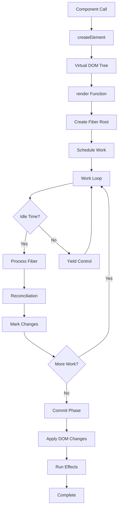

# 🚀 MiniReact - Educational React Implementation


MiniReact é uma implementação educacional do React, criada para demonstrar como frameworks modernos de UI funcionam internamente. Este projeto implementa os conceitos fundamentais do React do zero, incluindo Virtual DOM, Fiber Architecture, Hooks, e sistema de reconciliação.

## 📋 Índice

- [Características](#-características)
- [Arquitetura](#-arquitetura)
- [Instalação](#-instalação)
- [Uso Básico](#-uso-básico)
- [API Reference](#-api-reference)
- [Exemplos](#-exemplos)
- [Estrutura do Projeto](#-estrutura-do-projeto)
- [Como Funciona](#-como-funciona)
- [Desenvolvimento](#-desenvolvimento)
- [Documentação](#-documentação)
- [Limitações](#-limitações)
- [Contribuindo](#-contribuindo)
- [Licença](#-licença)

## ✨ Características

### Core Features

- **🎯 Virtual DOM** - Representação em memória da UI para otimização de performance
- **🧬 Fiber Architecture** - Renderização incremental e interruptível com priorização
- **♻️ Reconciliation Algorithm** - Algoritmo eficiente de diff e patch O(n)
- **🔑 Key-based Reconciliation** - Otimização para listas dinâmicas com keys
- **⚡ Synthetic Event System** - Sistema de eventos sintéticos com delegação
- **🎨 Component System** - Componentes funcionais e de classe (legacy)
- **🔄 Batch Updates** - Atualizações em lote para melhor performance

### Hooks Implementados

- **`useState`** - Gerenciamento de estado local com atualizações funcionais
- **`useEffect`** - Efeitos colaterais com cleanup e dependências
- **`useReducer`** - Gerenciamento de estado complexo estilo Redux
- **`useMemo`** - Memoização de valores computacionalmente pesados
- **`useCallback`** - Memoização de callbacks para otimização
- **`useRef`** - Referências mutáveis para elementos DOM e valores persistentes

### Features Adicionais

- **📝 Controlled Forms** - Formulários totalmente controlados
- **🧹 Cleanup Functions** - Limpeza automática de efeitos
- **⚛️ Fragments** - Agrupamento sem wrapper DOM adicional
- **🎯 Conditional Rendering** - Renderização condicional eficiente
- **📦 Módulos ES6** - Arquitetura modular com imports/exports

## 🏗 Arquitetura

### Visão Geral do Sistema

```
MiniReact Architecture
│
├── Virtual DOM Layer
│   ├── createElement() - Cria elementos virtuais (VNodes)
│   └── updateDom() - Sincroniza VNodes com DOM real
│
├── Fiber Layer
│   ├── Fiber Tree - Estrutura de dados para componentes
│   ├── Work Loop - Processa fibers incrementalmente
│   ├── render() - Ponto de entrada para renderização
│   └── Scheduler - Agenda trabalho com requestIdleCallback
│
├── Reconciliation Layer
│   ├── Diffing - Compara árvores old vs new
│   ├── Effect Tags - Marca mudanças (PLACEMENT, UPDATE, DELETION)
│   └── Key Matching - Otimiza listas com keys
│
├── Commit Layer
│   ├── DOM Mutations - Aplica mudanças ao DOM
│   ├── Effect Execution - Executa useEffect
│   └── Cleanup - Limpa efeitos anteriores
│
└── Hooks Layer
    ├── Hook Storage - Armazena estado dos hooks
    ├── Hook Queue - Fila de atualizações
    └── Hook Utils - Validação e utilitários
```

### Fluxo de Renderização Detalhado



## 📦 Instalação

### Pré-requisitos

- Node.js 14+
- NPM 6+ ou Yarn
- Navegador moderno com suporte a ES6

### Setup Rápido

```bash
# Clone o repositório
git clone https://github.com/adaoraul/minireact.git
cd minireact

# Instale as dependências
npm install

# Inicie o servidor de desenvolvimento
npm start
# Acesse http://localhost:3000
```

### Scripts Disponíveis

```bash
npm start          # Inicia servidor de desenvolvimento
npm run lint       # Executa ESLint
npm run lint:fix   # Corrige problemas do ESLint
npm run format     # Formata código com Prettier
npm run docs       # Gera documentação JSDoc
npm run serve      # Servidor sem abrir navegador
npm run dev        # Modo desenvolvimento com no-cache
```

## 🚀 Uso Básico

### Hello World

```javascript
import { createElement, render } from './src/index.js';

function App() {
  return createElement('h1', null, 'Hello, MiniReact!');
}

const container = document.getElementById('root');
render(createElement(App), container);
```

### Componente com Estado

```javascript
import { createElement, render, useState } from './src/index.js';

function Counter() {
  const [count, setCount] = useState(0);

  return createElement(
    'div',
    null,
    createElement('h2', null, `Count: ${count}`),
    createElement('button', { onClick: () => setCount(count + 1) }, 'Increment'),
    createElement(
      'button',
      { onClick: () => setCount((c) => c - 1) }, // Atualização funcional
      'Decrement'
    )
  );
}

render(createElement(Counter), document.getElementById('root'));
```

### Componente com Efeitos

```javascript
import { createElement, useState, useEffect } from './src/index.js';

function Timer() {
  const [seconds, setSeconds] = useState(0);
  const [isRunning, setIsRunning] = useState(true);

  useEffect(() => {
    if (!isRunning) return;

    const interval = setInterval(() => {
      setSeconds((s) => s + 1);
    }, 1000);

    // Cleanup function
    return () => {
      console.log('Cleaning up timer');
      clearInterval(interval);
    };
  }, [isRunning]); // Re-executa quando isRunning muda

  return createElement(
    'div',
    null,
    createElement('p', null, `Seconds: ${seconds}`),
    createElement(
      'button',
      { onClick: () => setIsRunning(!isRunning) },
      isRunning ? 'Pause' : 'Resume'
    )
  );
}
```

## 📚 API Reference

### Core Functions

#### `createElement(type, props, ...children)`

Cria um elemento virtual (VNode).

**Parâmetros:**

- `type` {string|Function} - Tag HTML ou componente
- `props` {Object|null} - Propriedades do elemento
- `...children` {any} - Elementos filhos

**Retorna:** {VNode} - Elemento virtual

**Exemplo:**

```javascript
// Elemento HTML
const div = createElement('div', { className: 'container' }, 'Hello');

// Componente
const app = createElement(MyComponent, { name: 'World' });

// Com múltiplos filhos
const list = createElement(
  'ul',
  null,
  createElement('li', null, 'Item 1'),
  createElement('li', null, 'Item 2')
);
```

#### `render(element, container)`

Renderiza um elemento virtual no DOM.

**Parâmetros:**

- `element` {VNode} - Elemento virtual para renderizar
- `container` {HTMLElement} - Container DOM

**Exemplo:**

```javascript
const App = () => createElement('h1', null, 'Hello');
render(createElement(App), document.getElementById('root'));
```

### Hooks

#### `useState(initialValue)`

Hook para gerenciar estado local.

**Parâmetros:**

- `initialValue` {T} - Valor inicial do estado

**Retorna:** [T, Function] - Par [estado, setState]

**Exemplo:**

```javascript
function Component() {
  const [count, setCount] = useState(0);
  const [user, setUser] = useState({ name: 'John' });

  // Atualização direta
  setCount(5);

  // Atualização funcional (recomendado para valores baseados no anterior)
  setCount((prev) => prev + 1);

  // Atualização de objeto
  setUser((prev) => ({ ...prev, age: 30 }));
}
```

#### `useEffect(effect, deps)`

Hook para efeitos colaterais e ciclo de vida.

**Parâmetros:**

- `effect` {Function} - Função de efeito que pode retornar cleanup
- `deps` {Array|undefined} - Dependências que disparam re-execução

**Comportamento:**

- `deps` undefined - Executa após cada render
- `deps` [] - Executa apenas na montagem
- `deps` [a, b] - Executa quando a ou b mudam

**Exemplo:**

```javascript
function Component() {
  const [data, setData] = useState(null);

  // Executa uma vez na montagem
  useEffect(() => {
    fetchData().then(setData);
  }, []);

  // Executa quando userId muda
  useEffect(() => {
    fetchUser(userId).then(setUser);
  }, [userId]);

  // Com cleanup
  useEffect(() => {
    const handler = () => console.log('click');
    window.addEventListener('click', handler);

    return () => {
      window.removeEventListener('click', handler);
    };
  }, []);
}
```

#### `useReducer(reducer, initialState)`

Hook para gerenciamento de estado complexo.

**Parâmetros:**

- `reducer` {Function} - Função (state, action) => newState
- `initialState` {T} - Estado inicial

**Retorna:** [T, Function] - Par [estado, dispatch]

**Exemplo:**

```javascript
const todoReducer = (state, action) => {
  switch (action.type) {
    case 'ADD':
      return [...state, action.todo];
    case 'REMOVE':
      return state.filter((t) => t.id !== action.id);
    case 'TOGGLE':
      return state.map((t) => (t.id === action.id ? { ...t, done: !t.done } : t));
    default:
      return state;
  }
};

function TodoList() {
  const [todos, dispatch] = useReducer(todoReducer, []);

  const addTodo = (text) => {
    dispatch({
      type: 'ADD',
      todo: { id: Date.now(), text, done: false },
    });
  };

  const toggleTodo = (id) => {
    dispatch({ type: 'TOGGLE', id });
  };

  // ... render
}
```

#### `useMemo(compute, deps)`

Hook para memoizar valores computados.

**Parâmetros:**

- `compute` {Function} - Função que computa o valor
- `deps` {Array} - Dependências para recálculo

**Retorna:** {T} - Valor memoizado

**Exemplo:**

```javascript
function ExpensiveComponent({ items, filter }) {
  // Só recalcula quando items ou filter mudam
  const filteredItems = useMemo(() => {
    console.log('Filtering...');
    return items
      .filter((item) => item.name.includes(filter))
      .sort((a, b) => b.priority - a.priority);
  }, [items, filter]);

  // Memoiza objeto para evitar re-renders
  const config = useMemo(
    () => ({ theme: 'dark', size: 'large' }),
    [] // Nunca muda
  );

  return createElement('div', null /* ... */);
}
```

#### `useCallback(callback, deps)`

Hook para memoizar callbacks.

**Parâmetros:**

- `callback` {Function} - Função callback
- `deps` {Array} - Dependências

**Retorna:** {Function} - Callback memoizado

**Exemplo:**

```javascript
function Parent({ data }) {
  // Evita recriar função a cada render
  const handleClick = useCallback(
    (id) => {
      console.log('Clicked:', id);
      updateItem(id);
    },
    [] // Função nunca muda
  );

  // Recria apenas quando data muda
  const processData = useCallback(() => {
    return data.map(transformItem);
  }, [data]);

  return createElement(Child, { onClick: handleClick });
}
```

## 💡 Exemplos Avançados

### Lista com Keys e Otimização

```javascript
function TodoList() {
  const [todos, setTodos] = useState([]);
  const [filter, setFilter] = useState('all');

  // Memoiza lista filtrada
  const visibleTodos = useMemo(() => {
    switch (filter) {
      case 'active':
        return todos.filter((t) => !t.completed);
      case 'completed':
        return todos.filter((t) => t.completed);
      default:
        return todos;
    }
  }, [todos, filter]);

  // Memoiza callbacks
  const toggleTodo = useCallback((id) => {
    setTodos((prev) =>
      prev.map((todo) => (todo.id === id ? { ...todo, completed: !todo.completed } : todo))
    );
  }, []);

  return createElement(
    'div',
    null,
    ...visibleTodos.map((todo) =>
      createElement(TodoItem, {
        key: todo.id, // Importante para performance!
        todo,
        onToggle: toggleTodo,
      })
    )
  );
}
```

### Formulário Controlado Completo

```javascript
function ContactForm() {
  const [formData, setFormData] = useState({
    name: '',
    email: '',
    message: '',
  });
  const [errors, setErrors] = useState({});
  const [isSubmitting, setIsSubmitting] = useState(false);

  // Validação
  const validate = useCallback(() => {
    const newErrors = {};
    if (!formData.name) newErrors.name = 'Nome obrigatório';
    if (!formData.email) newErrors.email = 'Email obrigatório';
    if (!/\S+@\S+\.\S+/.test(formData.email)) {
      newErrors.email = 'Email inválido';
    }
    return newErrors;
  }, [formData]);

  // Update field
  const updateField = useCallback((field, value) => {
    setFormData((prev) => ({ ...prev, [field]: value }));
    // Limpa erro do campo
    setErrors((prev) => ({ ...prev, [field]: undefined }));
  }, []);

  // Submit
  const handleSubmit = useCallback(
    async (e) => {
      e.preventDefault();

      const newErrors = validate();
      if (Object.keys(newErrors).length > 0) {
        setErrors(newErrors);
        return;
      }

      setIsSubmitting(true);
      try {
        await submitForm(formData);
        // Reset form
        setFormData({ name: '', email: '', message: '' });
      } finally {
        setIsSubmitting(false);
      }
    },
    [formData, validate]
  );

  return createElement(
    'form',
    { onSubmit: handleSubmit },
    createElement('input', {
      type: 'text',
      value: formData.name,
      onInput: (e) => updateField('name', e.target.value),
      disabled: isSubmitting,
    }),
    errors.name && createElement('span', { className: 'error' }, errors.name),
    // ... outros campos
    createElement(
      'button',
      {
        type: 'submit',
        disabled: isSubmitting,
      },
      isSubmitting ? 'Enviando...' : 'Enviar'
    )
  );
}
```

### Custom Hook - useLocalStorage

```javascript
// Custom hook para sincronizar com localStorage
function useLocalStorage(key, initialValue) {
  // Estado inicial do localStorage ou valor padrão
  const [storedValue, setStoredValue] = useState(() => {
    try {
      const item = window.localStorage.getItem(key);
      return item ? JSON.parse(item) : initialValue;
    } catch (error) {
      console.error(error);
      return initialValue;
    }
  });

  // Função para atualizar localStorage e estado
  const setValue = useCallback(
    (value) => {
      try {
        const valueToStore = value instanceof Function ? value(storedValue) : value;
        setStoredValue(valueToStore);
        window.localStorage.setItem(key, JSON.stringify(valueToStore));
      } catch (error) {
        console.error(error);
      }
    },
    [key, storedValue]
  );

  return [storedValue, setValue];
}

// Uso
function Settings() {
  const [theme, setTheme] = useLocalStorage('theme', 'light');
  const [language, setLanguage] = useLocalStorage('language', 'pt');

  return createElement('div', null /* ... */);
}
```

## 📁 Estrutura do Projeto

```
minireact/
├── src/                        # Código fonte do framework
│   ├── index.js               # Entry point e exports públicos
│   │
│   ├── core/                  # Núcleo do framework
│   │   ├── constants.js       # Constantes (EFFECT_TAGS, TEXT_ELEMENT)
│   │   ├── fiber.js           # Fiber, work loop, render function
│   │   ├── reconciler.js      # Algoritmo de reconciliação
│   │   └── commit.js          # Fase de commit e mutações DOM
│   │
│   ├── vdom/                  # Virtual DOM
│   │   ├── createElement.js   # Criação de elementos virtuais
│   │   └── updateDom.js       # Sincronização com DOM real
│   │
│   ├── hooks/                 # Sistema de Hooks
│   │   ├── index.js          # Re-export de todos os hooks
│   │   ├── hookUtils.js      # Utilitários compartilhados
│   │   ├── useState.js       # Hook de estado
│   │   ├── useEffect.js      # Hook de efeitos
│   │   ├── useReducer.js     # Hook reducer
│   │   ├── useMemo.js        # Hook de memoização
│   │   └── useCallback.js    # Hook de callback
│   │
│   └── component.js          # Classe Component (legacy)
│
├── examples/                  # Exemplos e demos
│   ├── index.html            # Demo principal completo
│   ├── timer-test.html       # Teste específico de timer
│   └── useEffect-test.html   # Teste de useEffect
│
├── docs/                     # Documentação gerada (JSDoc)
│
├── .eslintrc.json           # Configuração ESLint
├── .prettierrc              # Configuração Prettier
├── package.json             # Dependências e scripts
├── LICENSE                  # Licença MIT
└── README.md               # Este arquivo
```

## ⚙️ Como Funciona

### Virtual DOM

O Virtual DOM é uma representação JavaScript leve da árvore DOM real. Quando o estado muda:

1. Criamos uma nova árvore Virtual DOM
2. Comparamos com a árvore anterior (diffing)
3. Calculamos o conjunto mínimo de mudanças
4. Aplicamos apenas essas mudanças ao DOM real

**Benefícios:**

- Reduz manipulações DOM custosas
- Permite otimizações em batch
- Facilita programação declarativa

### Fiber Architecture

Fiber é uma reimplementação do algoritmo de reconciliação do React. Cada fiber é uma unidade de trabalho que representa um componente.

**Estrutura do Fiber:**

```javascript
{
  type: Function | string,    // Tipo do componente
  props: Object,              // Propriedades
  dom: HTMLElement,           // Nó DOM associado
  parent: Fiber,              // Fiber pai
  child: Fiber,               // Primeiro filho
  sibling: Fiber,             // Próximo irmão
  alternate: Fiber,           // Fiber da renderização anterior
  effectTag: string,          // PLACEMENT | UPDATE | DELETION
  hooks: Array                // Estado dos hooks
}
```

**Work Loop:**

```javascript
function workLoop(deadline) {
  while (nextUnitOfWork && deadline.timeRemaining() > 1) {
    nextUnitOfWork = performUnitOfWork(nextUnitOfWork);
  }

  if (!nextUnitOfWork && wipRoot) {
    commitRoot(); // Aplica mudanças ao DOM
  }

  requestIdleCallback(workLoop);
}
```

### Reconciliação

O algoritmo de reconciliação compara árvores e determina mudanças:

1. **Same Type**: Atualiza props, mantém instância
2. **Different Type**: Remove antiga, cria nova
3. **Keys**: Identifica elementos em listas para reordenação eficiente

**Complexidade:** O(n) onde n = número de elementos

### Sistema de Hooks

Hooks permitem estado e efeitos em componentes funcionais. Cada hook:

1. Valida contexto (deve estar em componente)
2. Obtém/cria slot de armazenamento
3. Compara com renderização anterior
4. Agenda re-render se necessário

**Regras dos Hooks:**

- Apenas no top-level (não em condicionais/loops)
- Apenas em componentes funcionais
- Ordem consistente entre renders

### Commit Phase

Após reconciliação, a fase de commit:

1. Aplica todas as mudanças DOM de uma vez
2. Executa efeitos (useEffect)
3. Limpa efeitos anteriores
4. É síncrona e não pode ser interrompida

## 🛠 Desenvolvimento

### Setup de Desenvolvimento

```bash
# Clone e instale
git clone https://github.com/adaoraul/minireact.git
cd minireact
npm install

# Desenvolvimento com hot-reload manual
npm run dev

# Verificar código
npm run lint
npm run format:check

# Corrigir código
npm run lint:fix
npm run format
```

### Debugging

Para debug, use as Chrome DevTools:

```javascript
// Adicione breakpoints ou logs
console.log('Current fiber:', window.minireact.wipFiber);
console.log('Work root:', window.minireact.wipRoot);
console.log('Hook index:', window.minireact.hookIndex);

// Inspecione o estado global
window.minireact; // Objeto com estado interno
```

### Testes Manuais

Abra os arquivos de exemplo no navegador:

1. `examples/index.html` - Suite completa de componentes
2. `examples/timer-test.html` - Teste de intervalos e cleanup
3. `examples/useEffect-test.html` - Teste de dependências de efeitos

### Performance Profiling

Use o Performance tab do Chrome DevTools:

1. Start recording
2. Interaja com a aplicação
3. Stop recording
4. Analise o flame chart

Procure por:

- `workLoop` - Tempo de reconciliação
- `commitRoot` - Tempo de commit
- `updateDom` - Manipulações DOM

## 📖 Documentação

### Gerando Documentação JSDoc

```bash
# Gera documentação HTML
npm run docs

# Visualiza no navegador
open docs/index.html
```

A documentação inclui:

- Descrições detalhadas de cada função
- Parâmetros com tipos
- Exemplos de uso
- Diagramas de arquitetura
- Links para código fonte

### Estilo de Documentação

Todo código segue JSDoc com:

- `@fileoverview` - Descrição do arquivo
- `@module` - Nome do módulo
- `@param` - Parâmetros tipados
- `@returns` - Tipo de retorno
- `@example` - Exemplos práticos
- `@description` - Explicação detalhada

## ⚠️ Limitações

Este é um projeto educacional. **NÃO use em produção**.

### Não Implementado

- ❌ React DevTools
- ❌ Server-Side Rendering (SSR)
- ❌ Suspense & Concurrent Mode
- ❌ Context API
- ❌ Portals
- ❌ Error Boundaries
- ❌ Synthetic Event Pooling
- ✅ useRef (implemented)
- ❌ forwardRef
- ❌ useLayoutEffect
- ❌ useImperativeHandle
- ❌ Lazy loading

### Diferenças do React

- Performance inferior (sem otimizações de produção)
- Sem batching automático de setState
- Sem priorização de updates
- Event handling mais simples
- Sem hydration para SSR

### Bugs Conhecidos

- Memory leaks em alguns edge cases com effects
- Race conditions em updates muito rápidos
- Keys nem sempre otimizam corretamente

## 🤝 Contribuindo

Contribuições são bem-vindas! Este é um projeto educacional perfeito para aprender.

### Como Contribuir

1. **Fork** o projeto
2. **Clone** seu fork
   ```bash
   git clone https://github.com/adaoraul/minireact.git
   ```
3. **Crie** uma branch
   ```bash
   git checkout -b feature/MinhaFeature
   ```
4. **Commit** suas mudanças
   ```bash
   git commit -m 'Add: MinhaFeature'
   ```
5. **Push** para a branch
   ```bash
   git push origin feature/MinhaFeature
   ```
6. **Abra** um Pull Request

### Guidelines

- ✅ Mantenha documentação em português
- ✅ Siga o estilo de código (ESLint + Prettier)
- ✅ Adicione exemplos para novas features
- ✅ Atualize README e JSDoc
- ✅ Teste manualmente as mudanças
- ✅ Commits descritivos

### Áreas para Contribuição

- 🎯 Implementar Context API
- 🎯 Adicionar mais hooks (useContext)
- 🎯 Melhorar performance
- 🎯 Adicionar testes automatizados
- 🎯 Criar mais exemplos
- 🎯 Traduzir para inglês

## 📝 Licença

Este projeto está licenciado sob a licença MIT - veja [LICENSE](LICENSE) para detalhes.

```
MIT License

Copyright (c) 2024 MiniReact

Permission is hereby granted, free of charge, to any person obtaining a copy
of this software and associated documentation files (the "Software"), to deal
in the Software without restriction, including without limitation the rights
to use, copy, modify, merge, publish, distribute, sublicense, and/or sell
copies of the Software, and to permit persons to whom the Software is
furnished to do so, subject to the following conditions:
...
```

## 🙏 Agradecimentos

- 💜 Inspirado pelo [React](https://reactjs.org/) do Meta/Facebook
- 📚 Baseado em [Build your own React](https://pomb.us/build-your-own-react/) de Rodrigo Pombo
- 🎓 Influenciado por [React Fiber Architecture](https://github.com/acdlite/react-fiber-architecture)
- 👥 Comunidade React pelos recursos educacionais
- ⭐ Todos os contribuidores deste projeto

## 📞 Suporte

- **Issues**: [GitHub Issues](https://github.com/adaoraul/minireact/issues)
- **Discussões**: [GitHub Discussions](https://github.com/adaoraul/minireact/discussions)

## 🚀 Roadmap

### v2.1.0 (Planejado)

- [ ] Context API básica
- [x] useRef implementation
- [ ] Error Boundaries

### v3.0.0 (Futuro)

- [ ] Concurrent Mode básico
- [ ] Suspense para data fetching
- [ ] Server Components (experimental)

---

<div align="center">

**⭐ Star este projeto se foi útil para seu aprendizado!**

Feito com 💜 para a comunidade de aprendizado

[Reportar Bug](https://github.com/adaoraul/minireact/issues) · [Sugerir Feature](https://github.com/adaoraul/minireact/issues)

</div>
