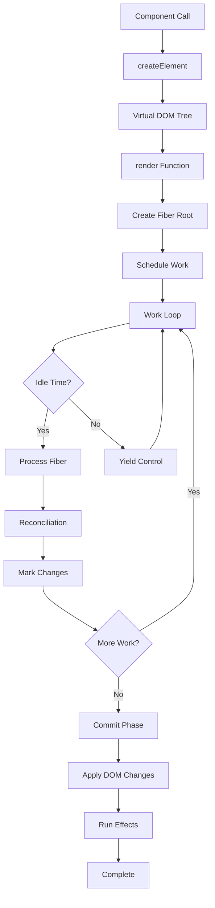

# 🚀 MiniReact - Educational React Implementation


MiniReact is an educational implementation of React, created to demonstrate how modern UI frameworks work internally. This project implements React's fundamental concepts from scratch, including Virtual DOM, Fiber Architecture, Hooks, and a reconciliation system.

## 📋 Table of Contents

- [Features](#-features)
- [Architecture](#-architecture)
- [Installation](#-installation)
- [Basic Usage](#-basic-usage)
- [API Reference](#-api-reference)
- [Examples](#-examples)
- [Project Structure](#-project-structure)
- [How It Works](#-how-it-works)
- [Development](#-development)
- [Documentation](#-documentation)
- [Limitations](#-limitations)
- [Contributing](#-contributing)
- [License](#-license)

## ✨ Features

### Core Features

- **🎯 Virtual DOM** - In-memory representation of the UI for performance optimization
- **🧬 Fiber Architecture** - Incremental and interruptible rendering with prioritization
- **♻️ Reconciliation Algorithm** - Efficient O(n) diff-and-patch algorithm
- **🔑 Key-based Reconciliation** - Optimization for dynamic lists using keys
- **⚡ Synthetic Event System** - Synthetic event system with delegation
- **🎨 Component System** - Functional and class components (legacy)
- **🔄 Batch Updates** - Batched updates for better performance

### Implemented Hooks

- **`useState`** - Local state management with functional updates
- **`useEffect`** - Side effects with cleanup and dependencies
- **`useReducer`** - Redux-style complex state management
- **`useMemo`** - Memoization of computationally expensive values
- **`useCallback`** - Memoization of callbacks for optimization
- **`useRef`** - Mutable references for DOM elements and persistent values

### Additional Features

- **📝 Controlled Forms** - Fully controlled forms
- **🧹 Cleanup Functions** - Automatic effect cleanup
- **⚛️ Fragments** - Grouping without an additional DOM wrapper
- **🎯 Conditional Rendering** - Efficient conditional rendering
- **📦 ES6 Modules** - Modular architecture with imports/exports

## 🏗 Architecture

### System Overview

```
MiniReact Architecture
│
├── Virtual DOM Layer
│   ├── createElement() - Creates virtual elements (VNodes)
│   └── updateDom() - Synchronizes VNodes with the real DOM
│
├── Fiber Layer
│   ├── Fiber Tree - Data structure for components
│   ├── Work Loop - Processes fibers incrementally
│   ├── render() - Entry point for rendering
│   └── Scheduler - Schedules work with requestIdleCallback
│
├── Reconciliation Layer
│   ├── Diffing - Compares old vs new trees
│   ├── Effect Tags - Marks changes (PLACEMENT, UPDATE, DELETION)
│   └── Key Matching - Optimizes lists with keys
│
├── Commit Layer
│   ├── DOM Mutations - Applies changes to the DOM
│   ├── Effect Execution - Runs useEffect
│   └── Cleanup - Cleans up previous effects
│
└── Hooks Layer
    ├── Hook Storage - Stores hook state
    ├── Hook Queue - Update queue
    └── Hook Utils - Validation and utilities
```

### Detailed Rendering Flow


```mermaid
graph TD
    A[Component Call] --> B[createElement]
    B --> C[Virtual DOM Tree]
    C --> D[render Function]
    D --> E[Create Fiber Root]
    E --> F[Schedule Work]
    F --> G[Work Loop]
    G --> H{Idle Time?}
    H -->|Yes| I[Process Fiber]
    H -->|No| J[Yield Control]
    J --> G
    I --> K[Reconciliation]
    K --> L[Mark Changes]
    L --> M{More Work?}
    M -->|Yes| G
    M -->|No| N[Commit Phase]
    N --> O[Apply DOM Changes]
    O --> P[Run Effects]
    P --> Q[Complete]
```

## 📦 Installation

### Prerequisites

- Node.js 14+
- NPM 6+ or Yarn
- Modern browser with ES6 support

### Quick Setup

```bash
# Clone the repository
git clone https://github.com/adaoraul/minireact.git
cd minireact

# Install dependencies
npm install

# Start the development server
npm start
# Visit http://localhost:3000
```

### Available Scripts

```bash
npm start          # Starts the development server
npm run lint       # Runs ESLint
npm run lint:fix   # Fixes ESLint issues
npm run format     # Formats code with Prettier
npm run docs       # Generates JSDoc documentation
npm run serve      # Server without opening the browser
npm run dev        # Development mode with no-cache
```

## 🚀 Basic Usage

### Hello World

```javascript
import { createElement, render } from './src/index.js';

function App() {
  return createElement('h1', null, 'Hello, MiniReact!');
}

const container = document.getElementById('root');
render(createElement(App), container);
```

### Component with State

```javascript
import { createElement, render, useState } from './src/index.js';

function Counter() {
  const [count, setCount] = useState(0);

  return createElement(
    'div',
    null,
    createElement('h2', null, `Count: ${count}`),
    createElement('button', { onClick: () => setCount(count + 1) }, 'Increment'),
    createElement(
      'button',
      { onClick: () => setCount((c) => c - 1) }, // Functional update
      'Decrement'
    )
  );
}

render(createElement(Counter), document.getElementById('root'));
```

### Component with Effects

```javascript
import { createElement, useState, useEffect } from './src/index.js';

function Timer() {
  const [seconds, setSeconds] = useState(0);
  const [isRunning, setIsRunning] = useState(true);

  useEffect(() => {
    if (!isRunning) return;

    const interval = setInterval(() => {
      setSeconds((s) => s + 1);
    }, 1000);

    // Cleanup function
    return () => {
      console.log('Cleaning up timer');
      clearInterval(interval);
    };
  }, [isRunning]); // Re-runs when isRunning changes

  return createElement(
    'div',
    null,
    createElement('p', null, `Seconds: ${seconds}`),
    createElement(
      'button',
      { onClick: () => setIsRunning(!isRunning) },
      isRunning ? 'Pause' : 'Resume'
    )
  );
}
```

## 📚 API Reference

### Core Functions

#### `createElement(type, props, ...children)`

Creates a virtual element (VNode).

**Parameters:**

- `type` {string|Function} - HTML tag or component
- `props` {Object|null} - Element properties
- `...children` {any} - Child elements

**Returns:** {VNode} - Virtual element

**Example:**

```javascript
// HTML element
const div = createElement('div', { className: 'container' }, 'Hello');

// Component
const app = createElement(MyComponent, { name: 'World' });

// With multiple children
const list = createElement(
  'ul',
  null,
  createElement('li', null, 'Item 1'),
  createElement('li', null, 'Item 2')
);
```

#### `render(element, container)`

Renders a virtual element into the DOM.

**Parameters:**

- `element` {VNode} - Virtual element to render
- `container` {HTMLElement} - DOM container

**Example:**

```javascript
const App = () => createElement('h1', null, 'Hello');
render(createElement(App), document.getElementById('root'));
```

### Hooks

#### `useState(initialValue)`

Hook for managing local state.

**Parameters:**

- `initialValue` {T} - Initial state value

**Returns:** [T, Function] - [state, setState] pair

**Example:**

```javascript
function Component() {
  const [count, setCount] = useState(0);
  const [user, setUser] = useState({ name: 'John' });

  // Direct update
  setCount(5);

  // Functional update (recommended for values based on the previous one)
  setCount((prev) => prev + 1);

  // Object update
  setUser((prev) => ({ ...prev, age: 30 }));
}
```

#### `useEffect(effect, deps)`

Hook for side effects and lifecycle.

**Parameters:**

- `effect` {Function} - Effect function that may return a cleanup
- `deps` {Array|undefined} - Dependencies that trigger re-execution

**Behavior:**

- `deps` undefined - Runs after every render
- `deps` [] - Runs only on mount
- `deps` [a, b] - Runs when a or b change

**Example:**

```javascript
function Component() {
  const [data, setData] = useState(null);

  // Runs once on mount
  useEffect(() => {
    fetchData().then(setData);
  }, []);

  // Runs when userId changes
  useEffect(() => {
    fetchUser(userId).then(setUser);
  }, [userId]);

  // With cleanup
  useEffect(() => {
    const handler = () => console.log('click');
    window.addEventListener('click', handler);

    return () => {
      window.removeEventListener('click', handler);
    };
  }, []);
}
```

#### `useReducer(reducer, initialState)`

Hook for managing complex state.

**Parameters:**

- `reducer` {Function} - Function (state, action) => newState
- `initialState` {T} - Initial state

**Returns:** [T, Function] - [state, dispatch] pair

**Example:**

```javascript
const todoReducer = (state, action) => {
  switch (action.type) {
    case 'ADD':
      return [...state, action.todo];
    case 'REMOVE':
      return state.filter((t) => t.id !== action.id);
    case 'TOGGLE':
      return state.map((t) => (t.id === action.id ? { ...t, done: !t.done } : t));
    default:
      return state;
  }
};

function TodoList() {
  const [todos, dispatch] = useReducer(todoReducer, []);

  const addTodo = (text) => {
    dispatch({
      type: 'ADD',
      todo: { id: Date.now(), text, done: false },
    });
  };

  const toggleTodo = (id) => {
    dispatch({ type: 'TOGGLE', id });
  };

  // ... render
}
```

#### `useMemo(compute, deps)`

Hook for memoizing computed values.

**Parameters:**

- `compute` {Function} - Function that computes the value
- `deps` {Array} - Dependencies for recomputation

**Returns:** {T} - Memoized value

**Example:**

```javascript
function ExpensiveComponent({ items, filter }) {
  // Only recalculates when items or filter change
  const filteredItems = useMemo(() => {
    console.log('Filtering...');
    return items
      .filter((item) => item.name.includes(filter))
      .sort((a, b) => b.priority - a.priority);
  }, [items, filter]);

  // Memoizes object to avoid re-renders
  const config = useMemo(
    () => ({ theme: 'dark', size: 'large' }),
    [] // Never changes
  );

  return createElement('div', null /* ... */);
}
```

#### `useCallback(callback, deps)`

Hook for memoizing callbacks.

**Parameters:**

- `callback` {Function} - Callback function
- `deps` {Array} - Dependencies

**Returns:** {Function} - Memoized callback

**Example:**

```javascript
function Parent({ data }) {
  // Avoids recreating the function on every render
  const handleClick = useCallback(
    (id) => {
      console.log('Clicked:', id);
      updateItem(id);
    },
    [] // Function never changes
  );

  // Recreates only when data changes
  const processData = useCallback(() => {
    return data.map(transformItem);
  }, [data]);

  return createElement(Child, { onClick: handleClick });
}
```

## 💡 Advanced Examples

### List with Keys and Optimization

```javascript
function TodoList() {
  const [todos, setTodos] = useState([]);
  const [filter, setFilter] = useState('all');

  // Memoizes filtered list
  const visibleTodos = useMemo(() => {
    switch (filter) {
      case 'active':
        return todos.filter((t) => !t.completed);
      case 'completed':
        return todos.filter((t) => t.completed);
      default:
        return todos;
    }
  }, [todos, filter]);

  // Memoizes callbacks
  const toggleTodo = useCallback((id) => {
    setTodos((prev) =>
      prev.map((todo) => (todo.id === id ? { ...todo, completed: !todo.completed } : todo))
    );
  }, []);

  return createElement(
    'div',
    null,
    ...visibleTodos.map((todo) =>
      createElement(TodoItem, {
        key: todo.id, // Important for performance!
        todo,
        onToggle: toggleTodo,
      })
    )
  );
}
```

### Complete Controlled Form

```javascript
function ContactForm() {
  const [formData, setFormData] = useState({
    name: '',
    email: '',
    message: '',
  });
  const [errors, setErrors] = useState({});
  const [isSubmitting, setIsSubmitting] = useState(false);

  // Validation
  const validate = useCallback(() => {
    const newErrors = {};
    if (!formData.name) newErrors.name = 'Name required';
    if (!formData.email) newErrors.email = 'Email required';
    if (!/\S+@\S+\.\S+/.test(formData.email)) {
      newErrors.email = 'Invalid email';
    }
    return newErrors;
  }, [formData]);

  // Update field
  const updateField = useCallback((field, value) => {
    setFormData((prev) => ({ ...prev, [field]: value }));
    // Clears the field error
    setErrors((prev) => ({ ...prev, [field]: undefined }));
  }, []);

  // Submit
  const handleSubmit = useCallback(
    async (e) => {
      e.preventDefault();

      const newErrors = validate();
      if (Object.keys(newErrors).length > 0) {
        setErrors(newErrors);
        return;
      }

      setIsSubmitting(true);
      try {
        await submitForm(formData);
        // Reset form
        setFormData({ name: '', email: '', message: '' });
      } finally {
        setIsSubmitting(false);
      }
    },
    [formData, validate]
  );

  return createElement(
    'form',
    { onSubmit: handleSubmit },
    createElement('input', {
      type: 'text',
      value: formData.name,
      onInput: (e) => updateField('name', e.target.value),
      disabled: isSubmitting,
    }),
    errors.name && createElement('span', { className: 'error' }, errors.name),
    // ... other fields
    createElement(
      'button',
      {
        type: 'submit',
        disabled: isSubmitting,
      },
      isSubmitting ? 'Submitting...' : 'Submit'
    )
  );
}
```

### Custom Hook - useLocalStorage

```javascript
// Custom hook to sync with localStorage
function useLocalStorage(key, initialValue) {
  // Initial state from localStorage or default value
  const [storedValue, setStoredValue] = useState(() => {
    try {
      const item = window.localStorage.getItem(key);
      return item ? JSON.parse(item) : initialValue;
    } catch (error) {
      console.error(error);
      return initialValue;
    }
  });

  // Function to update localStorage and state
  const setValue = useCallback(
    (value) => {
      try {
        const valueToStore = value instanceof Function ? value(storedValue) : value;
        setStoredValue(valueToStore);
        window.localStorage.setItem(key, JSON.stringify(valueToStore));
      } catch (error) {
        console.error(error);
      }
    },
    [key, storedValue]
  );

  return [storedValue, setValue];
}

// Usage
function Settings() {
  const [theme, setTheme] = useLocalStorage('theme', 'light');
  const [language, setLanguage] = useLocalStorage('language', 'en');

  return createElement('div', null /* ... */);
}
```

## 📁 Project Structure

```
minireact/
├── src/                        # Framework source code
│   ├── index.js               # Entry point and public exports
│   │
│   ├── core/                  # Framework core
│   │   ├── constants.js       # Constants (EFFECT_TAGS, TEXT_ELEMENT)
│   │   ├── fiber.js           # Fiber, work loop, render function
│   │   ├── reconciler.js      # Reconciliation algorithm
│   │   └── commit.js          # Commit phase and DOM mutations
│   │
│   ├── vdom/                  # Virtual DOM
│   │   ├── createElement.js   # Virtual element creation
│   │   └── updateDom.js       # Synchronization with the real DOM
│   │
│   ├── hooks/                 # Hooks system
│   │   ├── index.js          # Re-exports all hooks
│   │   ├── hookUtils.js      # Shared utilities
│   │   ├── useState.js       # State hook
│   │   ├── useEffect.js      # Effects hook
│   │   ├── useReducer.js     # Reducer hook
│   │   ├── useMemo.js        # Memoization hook
│   │   └── useCallback.js    # Callback hook
│   │
│   └── component.js          # Component class (legacy)
│
├── examples/                  # Examples and demos
│   ├── index.html            # Full main demo
│   ├── timer-test.html       # Timer-specific test
│   └── useEffect-test.html   # useEffect test
│
├── docs/                     # Generated documentation (JSDoc)
│
├── .eslintrc.json           # ESLint configuration
├── .prettierrc              # Prettier configuration
├── package.json             # Dependencies and scripts
├── LICENSE                  # MIT license
└── README.md               # This file
```

## ⚙️ How It Works

### Virtual DOM

The Virtual DOM is a lightweight JavaScript representation of the real DOM tree. When the state changes:

1. We create a new Virtual DOM tree
2. We compare it with the previous tree (diffing)
3. We calculate the minimal set of changes
4. We apply only those changes to the real DOM

**Benefits:**

- Reduces costly DOM manipulations
- Enables batch optimizations
- Facilitates declarative programming

### Fiber Architecture

Fiber is a reimplementation of React's reconciliation algorithm. Each fiber is a unit of work that represents a component.

**Fiber Structure:**

```javascript
{
  type: Function | string,    // Component type
  props: Object,              // Properties
  dom: HTMLElement,           // Associated DOM node
  parent: Fiber,              // Parent fiber
  child: Fiber,               // First child
  sibling: Fiber,             // Next sibling
  alternate: Fiber,           // Fiber from the previous render
  effectTag: string,          // PLACEMENT | UPDATE | DELETION
  hooks: Array                // Hook state
}
```

**Work Loop:**

```javascript
function workLoop(deadline) {
  while (nextUnitOfWork && deadline.timeRemaining() > 1) {
    nextUnitOfWork = performUnitOfWork(nextUnitOfWork);
  }

  if (!nextUnitOfWork && wipRoot) {
    commitRoot(); // Applies changes to the DOM
  }

  requestIdleCallback(workLoop);
}
```

### Reconciliation

The reconciliation algorithm compares trees and determines changes:

1. **Same Type**: Updates props, keeps the instance
2. **Different Type**: Removes the old one, creates a new one
3. **Keys**: Identifies elements in lists for efficient reordering

**Complexity:** O(n) where n = number of elements

### Hooks System

Hooks enable state and effects in functional components. Each hook:

1. Validates context (must be inside a component)
2. Gets/creates a storage slot
3. Compares with the previous render
4. Schedules a re-render if necessary

**Rules of Hooks:**

- Only at the top level (not inside conditionals/loops)
- Only in functional components
- Consistent order between renders

### Commit Phase

After reconciliation, the commit phase:

1. Applies all DOM changes at once
2. Runs effects (useEffect)
3. Cleans up previous effects
4. Is synchronous and cannot be interrupted

## 🛠 Development

### Development Setup

```bash
# Clone and install
git clone https://github.com/adaoraul/minireact.git
cd minireact
npm install

# Development with manual hot-reload
npm run dev

# Check code
npm run lint
npm run format:check

# Fix code
npm run lint:fix
npm run format
```

### Debugging

For debugging, use Chrome DevTools:

```javascript
// Add breakpoints or logs
console.log('Current fiber:', window.minireact.wipFiber);
console.log('Work root:', window.minireact.wipRoot);
console.log('Hook index:', window.minireact.hookIndex);

// Inspect the global state
window.minireact; // Object with internal state
```

### Manual Testing

Open the example files in your browser:

1. `examples/index.html` - Full component suite
2. `examples/timer-test.html` - Interval and cleanup test
3. `examples/useEffect-test.html` - Effect dependency test

### Performance Profiling

Use the Performance tab in Chrome DevTools:

1. Start recording
2. Interact with the application
3. Stop recording
4. Analyze the flame chart

Look for:

- `workLoop` - Reconciliation time
- `commitRoot` - Commit time
- `updateDom` - DOM manipulations

## 📖 Documentation

### Generating JSDoc Documentation

```bash
# Generates HTML documentation
npm run docs

# View in the browser
open docs/index.html
```

The documentation includes:

- Detailed descriptions of each function
- Typed parameters
- Usage examples
- Architecture diagrams
- Links to source code

### Documentation Style

All code follows JSDoc with:

- `@fileoverview` - File description
- `@module` - Module name
- `@param` - Typed parameters
- `@returns` - Return type
- `@example` - Practical examples
- `@description` - Detailed explanation

## ⚠️ Limitations

This is an educational project. **DO NOT use in production**.

### Not Implemented

- ❌ React DevTools
- ❌ Server-Side Rendering (SSR)
- ❌ Suspense & Concurrent Mode
- ❌ Context API
- ❌ Portals
- ❌ Error Boundaries
- ❌ Synthetic Event Pooling
- ✅ useRef (implemented)
- ❌ forwardRef
- ❌ useLayoutEffect
- ❌ useImperativeHandle
- ❌ Lazy loading

### Differences from React

- Lower performance (no production optimizations)
- No automatic setState batching
- No update prioritization
- Simpler event handling
- No hydration for SSR

### Known Bugs

- Memory leaks in some edge cases with effects
- Race conditions in very rapid updates

## 🤝 Contributing

Contributions are welcome! This is an educational project that's perfect for learning.

### How to Contribute

1. **Fork** the project
2. **Clone** your fork
   ```bash
   git clone https://github.com/adaoraul/minireact.git
   ```
3. **Create** a branch
   ```bash
   git checkout -b feature/MyFeature
   ```
4. **Commit** your changes
   ```bash
   git commit -m 'Add: MyFeature'
   ```
5. **Push** to the branch
   ```bash
   git push origin feature/MyFeature
   ```
6. **Open** a Pull Request

### Guidelines

- ✅ Keep documentation in English
- ✅ Follow the code style (ESLint + Prettier)
- ✅ Add examples for new features
- ✅ Update the README and JSDoc
- ✅ Manually test your changes
- ✅ Write descriptive commits

### Areas for Contribution

- 🎯 Implement Context API
- 🎯 Add more hooks (useContext)
- 🎯 Improve performance
- 🎯 Add automated tests
- 🎯 Create more examples

## 📝 License

This project is licensed under the MIT License - see [LICENSE](LICENSE) for details.

```
MIT License

Copyright (c) 2024 MiniReact

Permission is hereby granted, free of charge, to any person obtaining a copy
of this software and associated documentation files (the "Software"), to deal
in the Software without restriction, including without limitation the rights
to use, copy, modify, merge, publish, distribute, sublicense, and/or sell
copies of the Software, and to permit persons to whom the Software is
furnished to do so, subject to the following conditions:
...
```

## 🙏 Acknowledgements

- 💜 Inspired by [React](https://reactjs.org/) from Meta/Facebook
- 📚 Based on [Build your own React](https://pomb.us/build-your-own-react/) by Rodrigo Pombo
- 🎓 Influenced by [React Fiber Architecture](https://github.com/acdlite/react-fiber-architecture)
- 👥 The React community for educational resources
- ⭐ All contributors to this project

## 📞 Support

- **Issues**: [GitHub Issues](https://github.com/adaoraul/minireact/issues)
- **Discussions**: [GitHub Discussions](https://github.com/adaoraul/minireact/discussions)

## 🚀 Roadmap

### v2.1.0 (Planned)

- [ ] Basic Context API
- [x] useRef implementation
- [ ] Error Boundaries

### v3.0.0 (Future)

- [ ] Basic Concurrent Mode
- [ ] Suspense for data fetching
- [ ] Server Components (experimental)

---

<div align="center">

**⭐ Star this project if it helped your learning!**

Made with 💜 for the learning community

[Report Bug](https://github.com/adaoraul/minireact/issues) · [Suggest Feature](https://github.com/adaoraul/minireact/issues)

</div>
